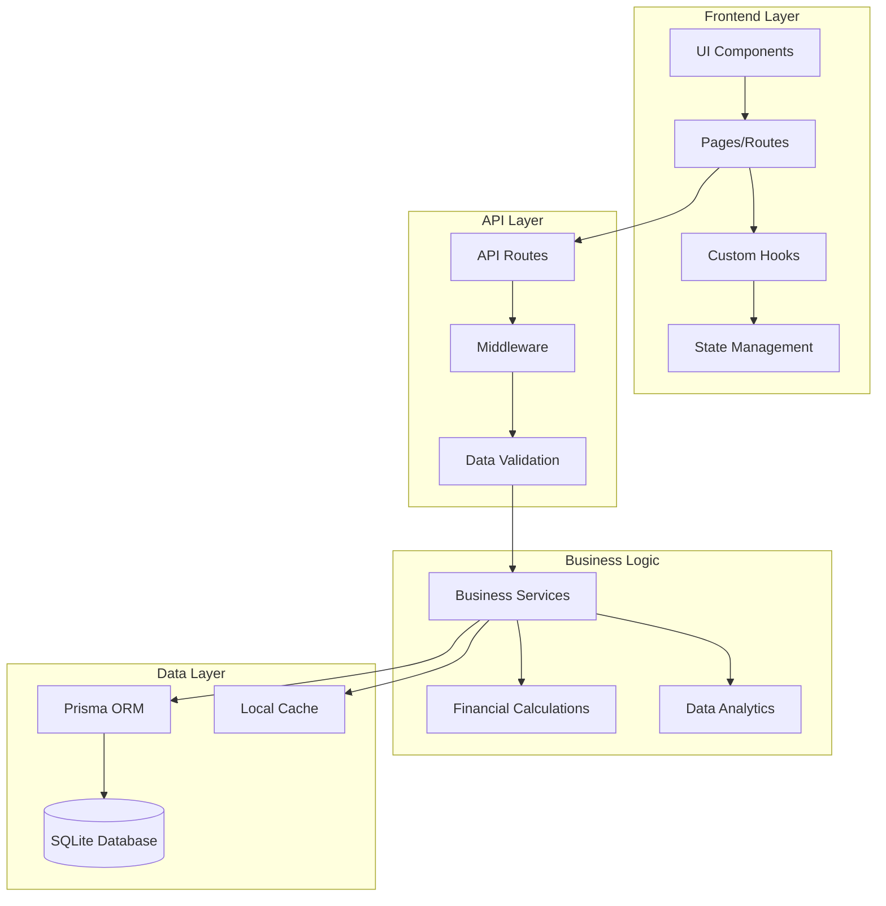
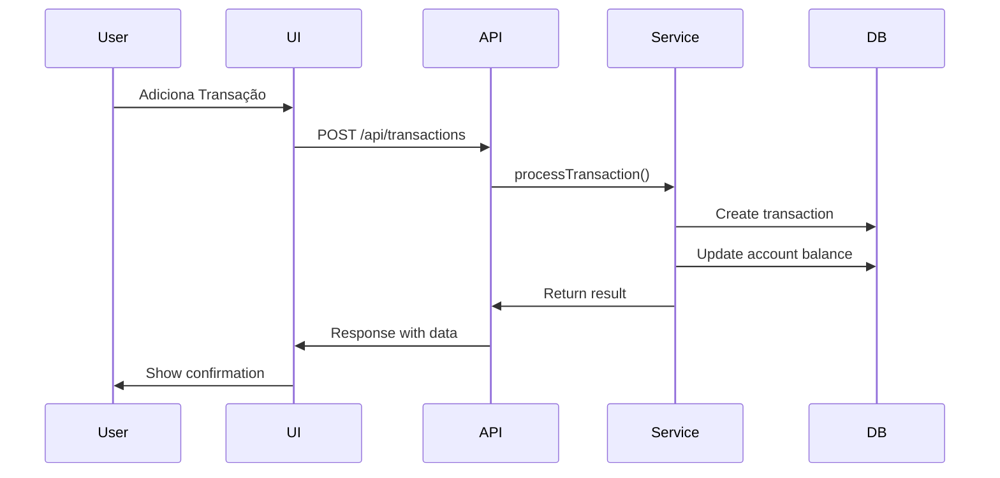
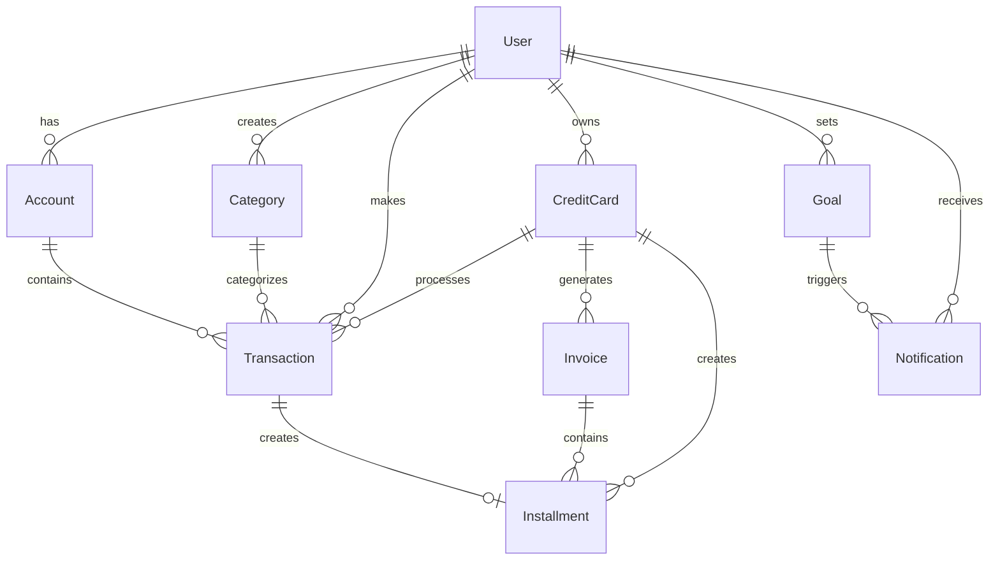
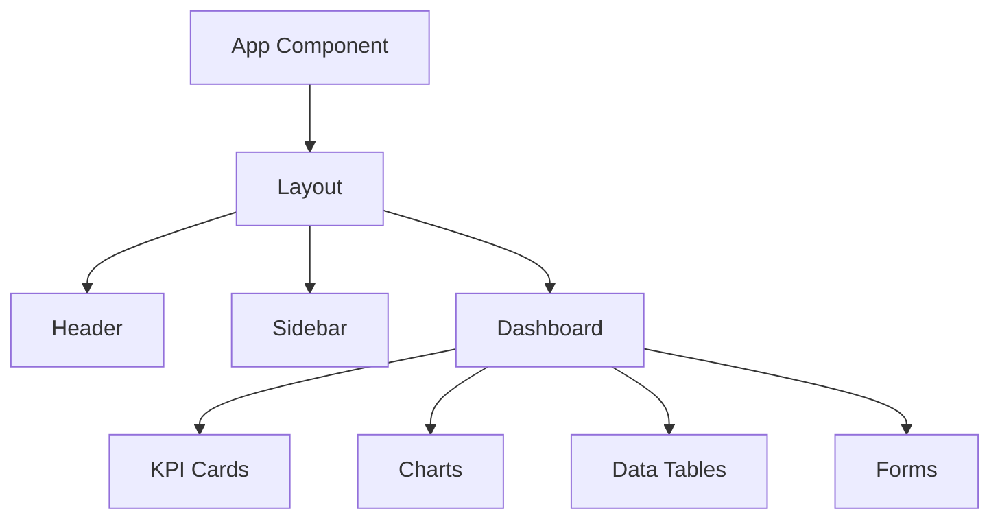
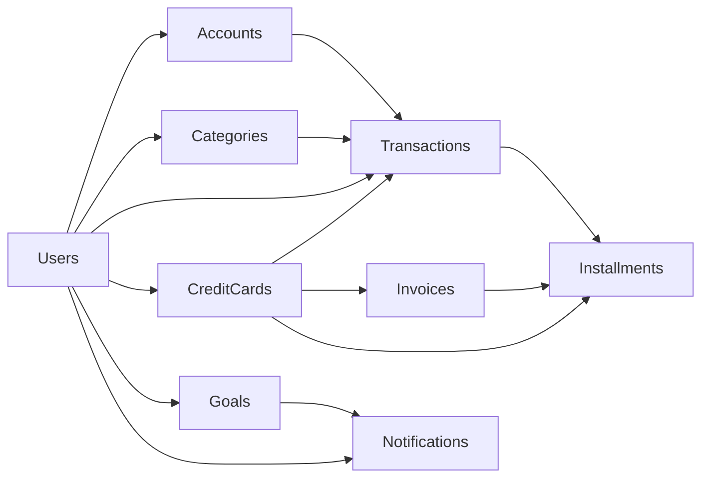
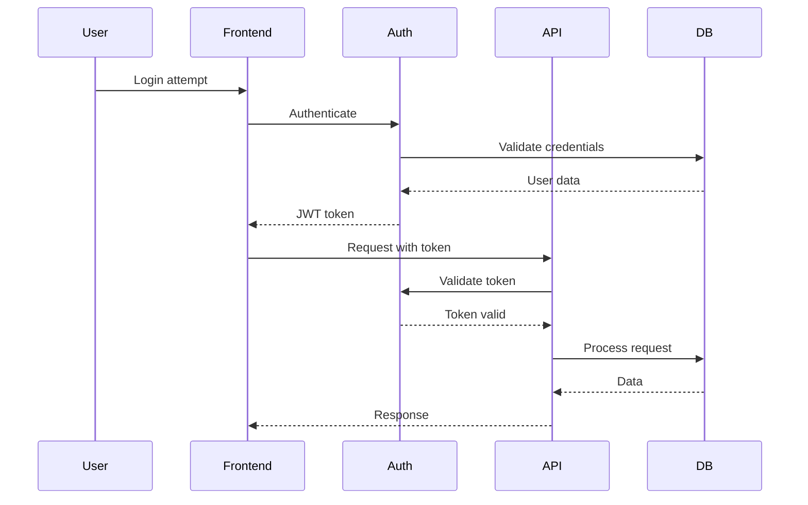
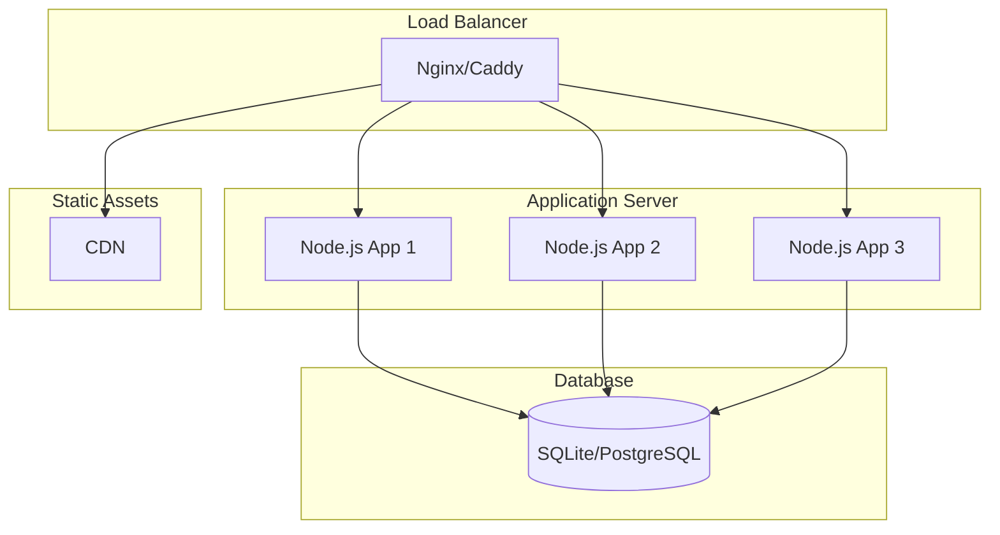

# Diagrama de Arquitetura - FinanceControl

## Visão Geral da Arquitetura



## Fluxo de Dados



## Modelo de Dados



## Arquitetura de Componentes

### Frontend Components



## API Architecture

### Routes Structure

```
/api/
├── accounts/
│   ├── GET / - List accounts
│   ├── POST / - Create account
│   ├── PUT /:id - Update account
│   └── DELETE /:id - Delete account
├── transactions/
│   ├── GET / - List transactions
│   ├── POST / - Create transaction
│   ├── PUT /:id - Update transaction
│   └── DELETE /:id - Delete transaction
├── credit-cards/
│   ├── GET / - List cards
│   ├── POST / - Create card
│   ├── PUT /:id - Update card
│   └── DELETE /:id - Delete card
├── installments/
│   ├── GET / - List installments
│   ├── POST / - Create installment plan
│   └── PUT /:id - Update installment
├── invoices/
│   ├── GET / - List invoices
│   ├── POST / - Generate invoice
│   └── PUT /:id - Update invoice
├── goals/
│   ├── GET / - List goals
│   ├── POST / - Create goal
│   └── PUT /:id - Update goal
├── dashboard/
│   └── GET / - Get dashboard data
└── financial-calculations/
    ├── GET / - Financial analysis
    └── POST / - Calculate installments
```

## Database Schema

### Tables Overview



## Security Architecture

### Authentication Flow



## Performance Considerations

### Caching Strategy
- **Client-side**: React Query for API caching
- **Server-side**: In-memory cache for frequent queries
- **Database**: Indexed queries for performance

### Optimization Techniques
- **Lazy loading** for large datasets
- **Pagination** for transaction lists
- **Debouncing** for search inputs
- **Memoization** for expensive calculations

## Deployment Architecture

### Production Environment



## Monitoring & Logging

### Key Metrics
- **Response time** for API endpoints
- **Database query performance**
- **Error rates** by endpoint
- **User engagement** metrics
- **Financial calculation accuracy**

### Logging Strategy
- **Structured logging** with JSON format
- **Error tracking** with stack traces
- **Performance monitoring** with timing data
- **Audit logs** for financial transactions

## Scalability Considerations

### Horizontal Scaling
- **Stateless API** design
- **Database connection pooling**
- **Load balancing** support
- **Microservices ready** architecture

### Vertical Scaling
- **Memory optimization** for large datasets
- **CPU optimization** for calculations
- **Storage optimization** for historical data

## Development Workflow

### Git Flow
```mermaid
gitgraph
    commit init
    branch develop
    checkout develop
    commit feature
    commit feature
    checkout main
    merge develop
    tag v1.0
    checkout develop
    branch feature/new
    commit feature
    checkout develop
    merge feature/new
    commit feature
    checkout main
    merge develop
    tag v1.1
```

### CI/CD Pipeline
1. **Code Quality**: ESLint, Prettier, TypeScript checks
2. **Testing**: Unit tests, Integration tests
3. **Build**: Next.js build process
4. **Deploy**: Automated deployment to staging/production
5. **Monitoring**: Health checks and performance monitoring

## Technology Stack Details

### Frontend Stack
- **Next.js 15**: React framework with App Router
- **TypeScript 5**: Static typing and better DX
- **Tailwind CSS**: Utility-first CSS framework
- **Shadcn/ui**: Modern React component library
- **React Hook Form**: Form management with validation
- **Zod**: Schema validation
- **Recharts**: Chart library for visualizations
- **Zustand**: State management

### Backend Stack
- **Next.js API Routes**: Serverless API endpoints
- **Prisma ORM**: Type-safe database access
- **SQLite**: Embedded database for development
- **Zod**: Input validation and type safety
- **Node.js**: JavaScript runtime

### Development Tools
- **ESLint**: Code linting
- **Prettier**: Code formatting
- **Husky**: Git hooks
- **TypeScript**: Static type checking
- **Jest**: Testing framework

## Best Practices

### Code Organization
- **Feature-based** folder structure
- **Separation of concerns** between UI and logic
- **Reusable components** with proper props
- **Custom hooks** for shared logic

### Performance
- **Code splitting** for better loading
- **Image optimization** with Next.js Image
- **Database indexing** for queries
- **Memoization** for expensive operations

### Security
- **Input validation** on all endpoints
- **SQL injection prevention** with Prisma
- **XSS protection** with proper sanitization
- **Authentication** with JWT tokens

This architecture provides a solid foundation for a scalable, maintainable, and performant financial management application.